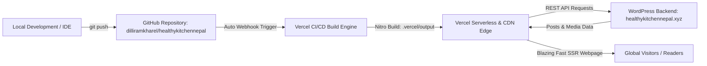

# Healthy Kitchen Nepal — GitHub to Vercel Deployment & Live Update Guide

This document outlines the complete step-by-step workflow to connect your repository to Vercel, deploy your TanStack Start SSR application, and maintain continuous live updates.

---

## 1. Overview of Architecture



- **Live URL**: `https://healthykitchennepal.vercel.app`
- **Frontend Framework**: TanStack Start (React 19 + TanStack Router + Vite + Nitro).
- **Hosting Platform**: Vercel (Edge CDN + Serverless Functions via Nitro `preset: 'vercel'`).
- **CMS Backend**: WordPress REST API at `https://healthykitchennepal.xyz/wp-json/wp/v2`.

---

## 2. Phase 1: Commit & Push Local Changes to GitHub

Your repository has `origin` configured to:
`https://github.com/dilliramkharel/healthykitchennepal.git`

*(Your personal backup remote is also saved under `personal`: `https://github.com/pkbasnet7153/healthy-kitchen-nepal.git`)*

Run the following terminal commands to stage, commit, and push updates:

```bash
# 1. Review changed files
git status

# 2. Stage all updated files
git add .

# 3. Commit the changes
git commit -m "chore: describe your updates here"

# 4. Push to GitHub main branch
git push origin main
```

---

## 3. Phase 2: Connect GitHub Repository to Vercel (Completed)

Your repository is now connected to Vercel:
- **Project**: `healthykitchennepal`
- **Live Production URL**: [https://healthykitchennepal.vercel.app](https://healthykitchennepal.vercel.app)
- **Deployment Strategy**: Automatic CI/CD on every push to `origin/main`.
   - **Framework Preset**: TanStack Start (detected automatically via `vercel.json`).
   - **Root Directory**: `./` (default).
   - **Build Command**: `npm run build` (default).
   - **Output Directory**: Leave default (Nitro outputs directly to `.vercel/output`).

4. **Add Environment Variables**:
   Expand the **Environment Variables** section and add:
   | Key | Value | Environment |
   | :--- | :--- | :--- |
   | `VITE_WP_API_URL` | `https://healthykitchennepal.xyz/wp-json/wp/v2` | Production, Preview, Development |

5. **Deploy**:
   - Click the **Deploy** button.
   - Vercel will clone the repo, install dependencies, execute `npm run build`, bundle the serverless functions and static assets, and assign a live URL (e.g., `healthy-kitchen-nepal.vercel.app`).

---

## 4. Phase 3: How Continuous Live Updates Work

Once connected, your deployment pipeline is **100% automated**. You never have to manually re-deploy.

### A. Updating Website Code & Design
Whenever you edit code, add new features, or tweak styles:
```bash
git add .
git commit -m "describe your changes here"
git push origin main
```
**What happens behind the scenes:**
1. GitHub fires a webhook event to Vercel.
2. Vercel automatically creates a new production deployment.
3. Your live site updates automatically in ~45–60 seconds with **zero downtime**.
4. If you push to a non-main branch (e.g. `feat/new-page`), Vercel automatically generates a dedicated **Preview URL** so you can test before merging!

### B. Publishing New WordPress Articles
Because your website uses dynamic Server-Side Rendering (SSR) with TanStack Query:
1. Whenever you add or edit articles in **WordPress Admin** (`https://healthykitchennepal.xyz/wp-admin`), the WordPress REST API updates immediately.
2. When a user visits `/blog` or `/blog/$slug`, the app queries WordPress directly.
3. **No git commit or Vercel rebuild is required** to publish new blog posts! They show up instantly.

---

## 5. Phase 4: Setting Up a Custom Domain (Optional)

To use your custom domain (e.g., `healthykitchennepal.xyz` or `app.healthykitchennepal.xyz`):

1. Go to your project on **Vercel Dashboard** -> **Settings** -> **Domains**.
2. Type your domain name and click **Add**.
3. Follow the DNS instructions provided by Vercel:
   - For an apex domain (`healthykitchennepal.xyz`): Add an `A` record pointing to `76.76.21.21`.
   - For a subdomain (`www` or `blog`): Add a `CNAME` record pointing to `cname.vercel-dns.com`.
4. Vercel will automatically provision a free SSL certificate (HTTPS) and route traffic worldwide.

---

## 6. Pre-Flight Verification Checklist

- [x] TypeScript compilation verified clean (`npx tsc --noEmit` passes with 0 errors).
- [x] Broken WordPress image URLs now gracefully display fallback (`BlogCardImage` & `BlogDetailImage`).
- [x] `vite.config.ts` configured with `nitro: { preset: 'vercel' }`.
- [x] `vercel.json` configured with `"framework": "tanstack-start"`.
- [x] `.gitignore` updated to exclude `.vercel/` build output from git commits.
- [x] Production build tested and verified locally (`.vercel/output` generated successfully).
